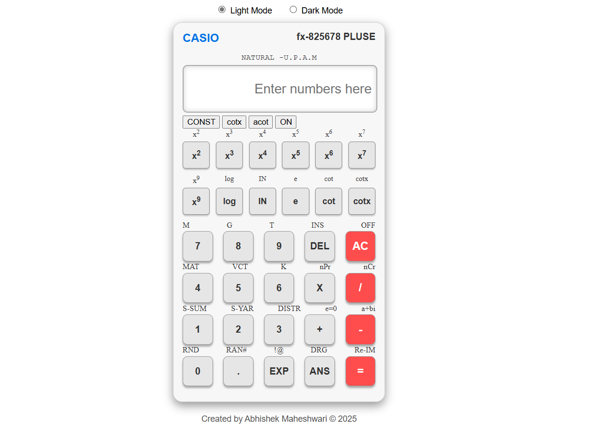

# 🧮 CASIO Calculator – Responsive Web Version

A functional and responsive replica of a **CASIO-style calculator** built with **HTML, CSS, and JavaScript**. Designed to offer a smooth and familiar experience, just like the classic physical calculator!
Create an responsive web design with basic funcinilaty of CASIO calculator

 <!-- Optional image preview -->

## 📽️ Demo Video

> Click below to watch a quick preview of the calculator in action.

[🎥 Watch CASIO.mp4](https://raw.githubusercontent.com/Abhishek-Maheshwari-778/CASIO_Calculator/main/CASIO.mp4)  
*(If the video doesn't autoplay in your browser, download and play locally.)*

---

## 🚀 Features

- 📱 **Responsive Design** – Works on both desktop and mobile
- 🖩 **Classic CASIO-style UI**
- ➕ ➖ ✖️ ➗ – Basic Arithmetic Functions and some more
- 🧼 **Clear (C) and Equals (=)** functionality
- 💻 **Pure HTML, CSS, and JavaScript**

---

## 💡 Learning Highlights

- DOM manipulation with vanilla JavaScript
- Grid layout & responsive styling
- Functional JS logic for calculator operations

---

## 🙏 Acknowledgment

Special thanks to **Ritik Dwivedi Sir**, my mentor, for his consistent support and guidance throughout this learning journey.

---

## 📂 Thanks
